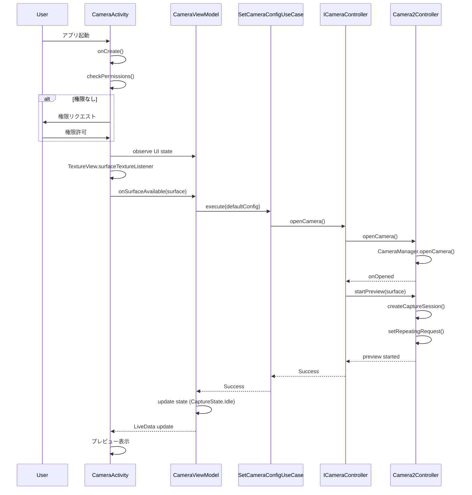
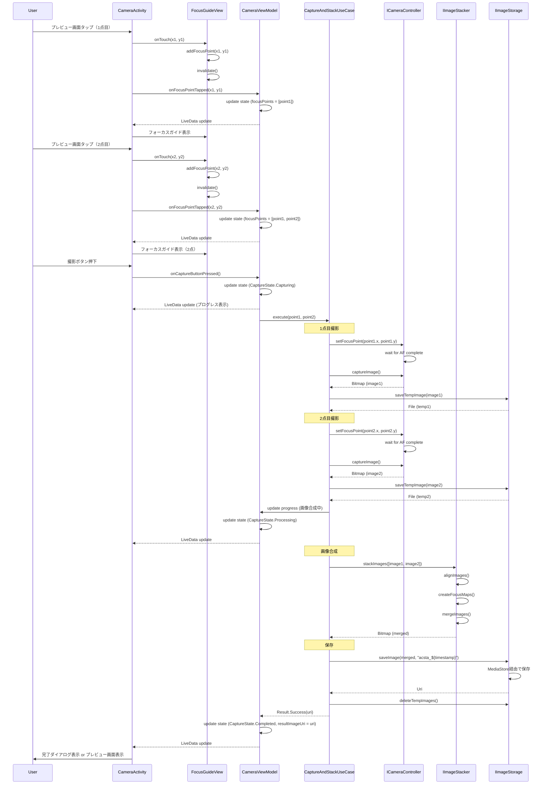
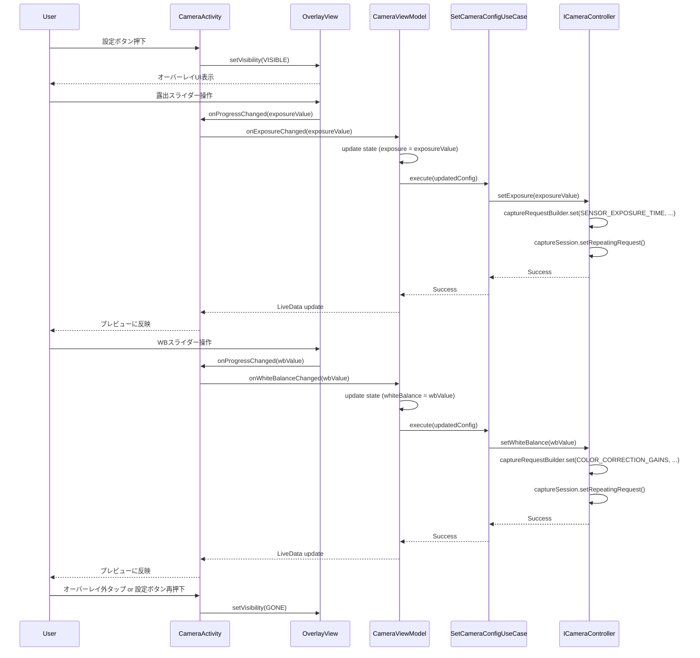
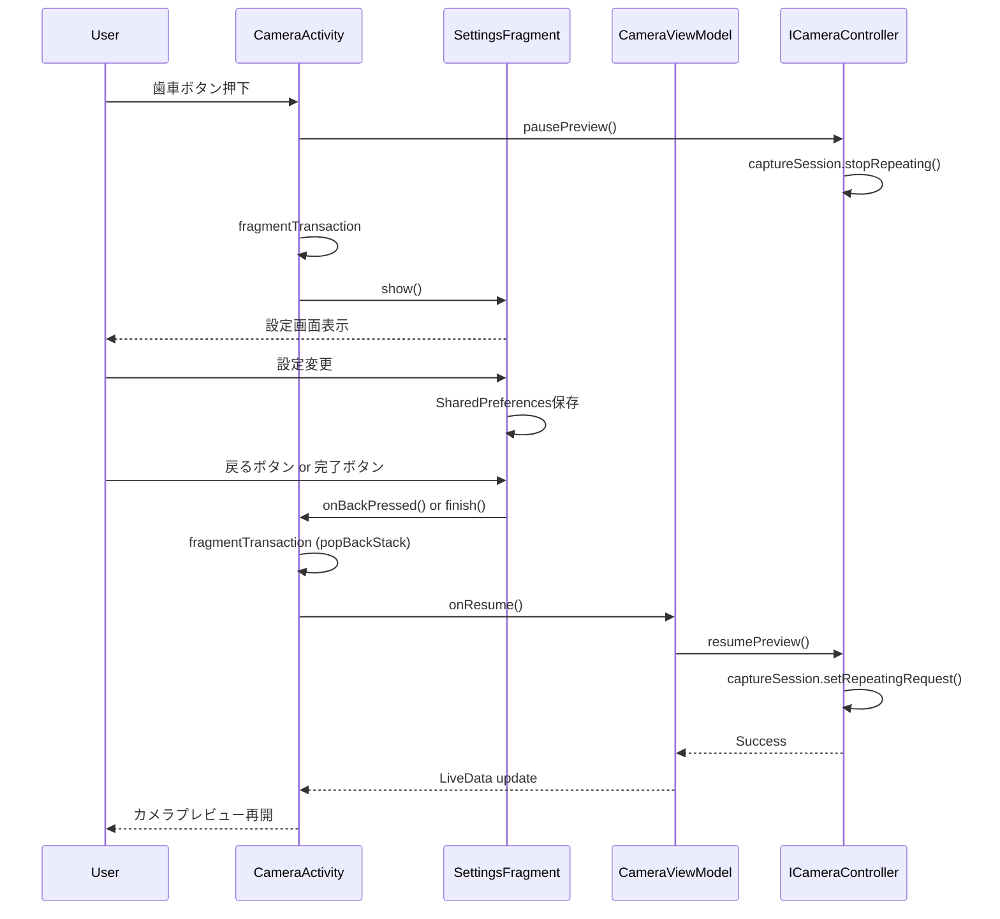
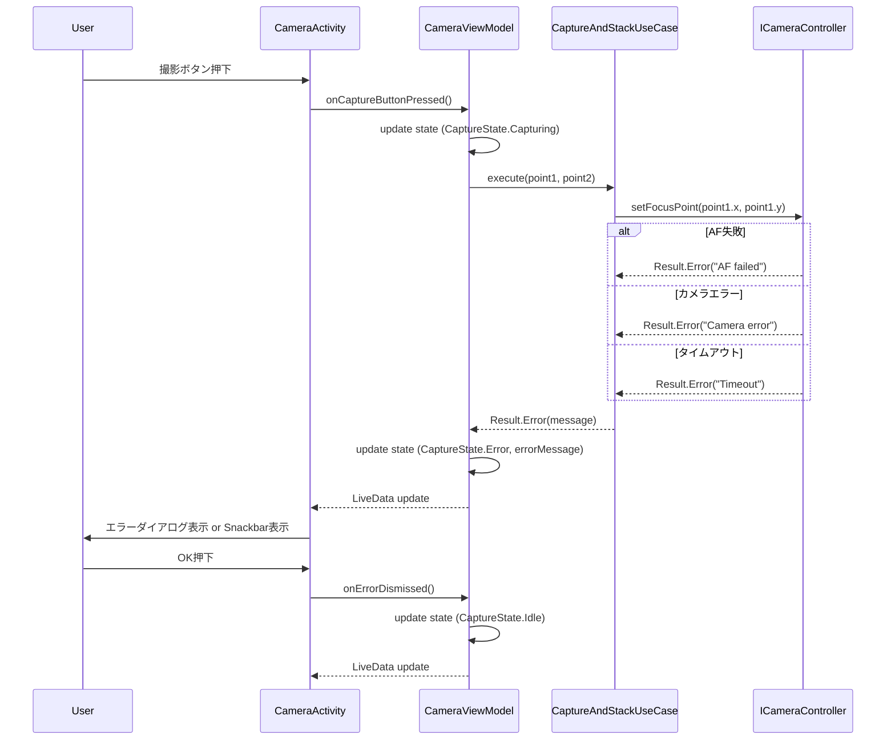

# シーケンス図（主要ケース）

## 1. アプリ起動→カメラプレビュー表示

```mermaid
sequenceDiagram
    participant User
    participant CameraActivity
    participant CameraViewModel
    participant SetCameraConfigUseCase
    participant ICameraController
    participant Camera2Controller
    
    User->>CameraActivity: アプリ起動
    CameraActivity->>CameraActivity: onCreate()
    CameraActivity->>CameraActivity: checkPermissions()
    alt 権限なし
        CameraActivity->>User: 権限リクエスト
        User->>CameraActivity: 権限許可
    end
    
    CameraActivity->>CameraViewModel: observe UI state
    CameraActivity->>CameraActivity: TextureView.surfaceTextureListener
    CameraActivity->>CameraViewModel: onSurfaceAvailable(surface)
    
    CameraViewModel->>SetCameraConfigUseCase: execute(defaultConfig)
    SetCameraConfigUseCase->>ICameraController: openCamera()
    ICameraController->>Camera2Controller: openCamera()
    Camera2Controller->>Camera2Controller: CameraManager.openCamera()
    Camera2Controller-->>ICameraController: onOpened
    
    ICameraController->>Camera2Controller: startPreview(surface)
    Camera2Controller->>Camera2Controller: createCaptureSession()
    Camera2Controller->>Camera2Controller: setRepeatingRequest()
    Camera2Controller-->>ICameraController: preview started
    
    ICameraController-->>SetCameraConfigUseCase: Success
    SetCameraConfigUseCase-->>CameraViewModel: Success
    CameraViewModel->>CameraViewModel: update state (CaptureState.Idle)
    CameraViewModel-->>CameraActivity: LiveData update
    CameraActivity->>CameraActivity: プレビュー表示
```

---

## 2. フォーカスポイント2点指定→撮影→画像合成→保存

```mermaid
sequenceDiagram
    participant User
    participant CameraActivity
    participant FocusGuideView
    participant CameraViewModel
    participant CaptureAndStackUseCase
    participant ICameraController
    participant IImageStacker
    participant IImageStorage
    
    User->>CameraActivity: プレビュー画面タップ（1点目）
    CameraActivity->>FocusGuideView: onTouch(x1, y1)
    FocusGuideView->>FocusGuideView: addFocusPoint(x1, y1)
    FocusGuideView->>FocusGuideView: invalidate()
    CameraActivity->>CameraViewModel: onFocusPointTapped(x1, y1)
    CameraViewModel->>CameraViewModel: update state (focusPoints = [point1])
    CameraViewModel-->>CameraActivity: LiveData update
    CameraActivity->>FocusGuideView: フォーカスガイド表示
    
    User->>CameraActivity: プレビュー画面タップ（2点目）
    CameraActivity->>FocusGuideView: onTouch(x2, y2)
    FocusGuideView->>FocusGuideView: addFocusPoint(x2, y2)
    FocusGuideView->>FocusGuideView: invalidate()
    CameraActivity->>CameraViewModel: onFocusPointTapped(x2, y2)
    CameraViewModel->>CameraViewModel: update state (focusPoints = [point1, point2])
    CameraViewModel-->>CameraActivity: LiveData update
    CameraActivity->>FocusGuideView: フォーカスガイド表示（2点）
    
    User->>CameraActivity: 撮影ボタン押下
    CameraActivity->>CameraViewModel: onCaptureButtonPressed()
    CameraViewModel->>CameraViewModel: update state (CaptureState.Capturing)
    CameraViewModel-->>CameraActivity: LiveData update (プログレス表示)
    
    CameraViewModel->>CaptureAndStackUseCase: execute(point1, point2)
    
    Note over CaptureAndStackUseCase: 1点目撮影
    CaptureAndStackUseCase->>ICameraController: setFocusPoint(point1.x, point1.y)
    ICameraController->>ICameraController: wait for AF complete
    CaptureAndStackUseCase->>ICameraController: captureImage()
    ICameraController-->>CaptureAndStackUseCase: Bitmap (image1)
    CaptureAndStackUseCase->>IImageStorage: saveTempImage(image1)
    IImageStorage-->>CaptureAndStackUseCase: File (temp1)
    
    Note over CaptureAndStackUseCase: 2点目撮影
    CaptureAndStackUseCase->>ICameraController: setFocusPoint(point2.x, point2.y)
    ICameraController->>ICameraController: wait for AF complete
    CaptureAndStackUseCase->>ICameraController: captureImage()
    ICameraController-->>CaptureAndStackUseCase: Bitmap (image2)
    CaptureAndStackUseCase->>IImageStorage: saveTempImage(image2)
    IImageStorage-->>CaptureAndStackUseCase: File (temp2)
    
    CaptureAndStackUseCase->>CameraViewModel: update progress (画像合成中)
    CameraViewModel->>CameraViewModel: update state (CaptureState.Processing)
    CameraViewModel-->>CameraActivity: LiveData update
    
    Note over CaptureAndStackUseCase: 画像合成
    CaptureAndStackUseCase->>IImageStacker: stackImages([image1, image2])
    IImageStacker->>IImageStacker: alignImages()
    IImageStacker->>IImageStacker: createFocusMaps()
    IImageStacker->>IImageStacker: mergeImages()
    IImageStacker-->>CaptureAndStackUseCase: Bitmap (merged)
    
    Note over CaptureAndStackUseCase: 保存
    CaptureAndStackUseCase->>IImageStorage: saveImage(merged, "acsta_${timestamp}")
    IImageStorage->>IImageStorage: MediaStore経由で保存
    IImageStorage-->>CaptureAndStackUseCase: Uri
    
    CaptureAndStackUseCase->>IImageStorage: deleteTempImages()
    
    CaptureAndStackUseCase-->>CameraViewModel: Result.Success(uri)
    CameraViewModel->>CameraViewModel: update state (CaptureState.Completed, resultImageUri = uri)
    CameraViewModel-->>CameraActivity: LiveData update
    
    CameraActivity->>User: 完了ダイアログ表示 or プレビュー画面表示
```

---

## 3. マニュアル設定（露出・WB）調整

```mermaid
sequenceDiagram
    participant User
    participant CameraActivity
    participant OverlayView
    participant CameraViewModel
    participant SetCameraConfigUseCase
    participant ICameraController
    
    User->>CameraActivity: 設定ボタン押下
    CameraActivity->>OverlayView: setVisibility(VISIBLE)
    OverlayView-->>User: オーバーレイUI表示
    
    User->>OverlayView: 露出スライダー操作
    OverlayView->>CameraActivity: onProgressChanged(exposureValue)
    CameraActivity->>CameraViewModel: onExposureChanged(exposureValue)
    CameraViewModel->>CameraViewModel: update state (exposure = exposureValue)
    
    CameraViewModel->>SetCameraConfigUseCase: execute(updatedConfig)
    SetCameraConfigUseCase->>ICameraController: setExposure(exposureValue)
    ICameraController->>ICameraController: captureRequestBuilder.set(SENSOR_EXPOSURE_TIME, ...)
    ICameraController->>ICameraController: captureSession.setRepeatingRequest()
    ICameraController-->>SetCameraConfigUseCase: Success
    SetCameraConfigUseCase-->>CameraViewModel: Success
    
    CameraViewModel-->>CameraActivity: LiveData update
    CameraActivity-->>User: プレビューに反映
    
    User->>OverlayView: WBスライダー操作
    OverlayView->>CameraActivity: onProgressChanged(wbValue)
    CameraActivity->>CameraViewModel: onWhiteBalanceChanged(wbValue)
    CameraViewModel->>CameraViewModel: update state (whiteBalance = wbValue)
    
    CameraViewModel->>SetCameraConfigUseCase: execute(updatedConfig)
    SetCameraConfigUseCase->>ICameraController: setWhiteBalance(wbValue)
    ICameraController->>ICameraController: captureRequestBuilder.set(COLOR_CORRECTION_GAINS, ...)
    ICameraController->>ICameraController: captureSession.setRepeatingRequest()
    ICameraController-->>SetCameraConfigUseCase: Success
    SetCameraConfigUseCase-->>CameraViewModel: Success
    
    CameraViewModel-->>CameraActivity: LiveData update
    CameraActivity-->>User: プレビューに反映
    
    User->>CameraActivity: オーバーレイ外タップ or 設定ボタン再押下
    CameraActivity->>OverlayView: setVisibility(GONE)
```

---

## 4. 設定画面遷移

```mermaid
sequenceDiagram
    participant User
    participant CameraActivity
    participant SettingsFragment
    participant CameraViewModel
    participant ICameraController
    
    User->>CameraActivity: 歯車ボタン押下
    CameraActivity->>ICameraController: pausePreview()
    ICameraController->>ICameraController: captureSession.stopRepeating()
    
    CameraActivity->>CameraActivity: fragmentTransaction
    CameraActivity->>SettingsFragment: show()
    SettingsFragment-->>User: 設定画面表示
    
    User->>SettingsFragment: 設定変更
    SettingsFragment->>SettingsFragment: SharedPreferences保存
    
    User->>SettingsFragment: 戻るボタン or 完了ボタン
    SettingsFragment->>CameraActivity: onBackPressed() or finish()
    CameraActivity->>CameraActivity: fragmentTransaction (popBackStack)
    
    CameraActivity->>CameraViewModel: onResume()
    CameraViewModel->>ICameraController: resumePreview()
    ICameraController->>ICameraController: captureSession.setRepeatingRequest()
    ICameraController-->>CameraViewModel: Success
    
    CameraViewModel-->>CameraActivity: LiveData update
    CameraActivity-->>User: カメラプレビュー再開
```

---

## 5. エラーハンドリング（撮影失敗）

```mermaid
sequenceDiagram
    participant User
    participant CameraActivity
    participant CameraViewModel
    participant CaptureAndStackUseCase
    participant ICameraController
    
    User->>CameraActivity: 撮影ボタン押下
    CameraActivity->>CameraViewModel: onCaptureButtonPressed()
    CameraViewModel->>CameraViewModel: update state (CaptureState.Capturing)
    
    CameraViewModel->>CaptureAndStackUseCase: execute(point1, point2)
    CaptureAndStackUseCase->>ICameraController: setFocusPoint(point1.x, point1.y)
    
    alt AF失敗
        ICameraController-->>CaptureAndStackUseCase: Result.Error("AF failed")
    else カメラエラー
        ICameraController-->>CaptureAndStackUseCase: Result.Error("Camera error")
    else タイムアウト
        ICameraController-->>CaptureAndStackUseCase: Result.Error("Timeout")
    end
    
    CaptureAndStackUseCase-->>CameraViewModel: Result.Error(message)
    CameraViewModel->>CameraViewModel: update state (CaptureState.Error, errorMessage)
    CameraViewModel-->>CameraActivity: LiveData update
    
    CameraActivity->>User: エラーダイアログ表示 or Snackbar表示
    User->>CameraActivity: OK押下
    CameraActivity->>CameraViewModel: onErrorDismissed()
    CameraViewModel->>CameraViewModel: update state (CaptureState.Idle)
    CameraViewModel-->>CameraActivity: LiveData update
```

